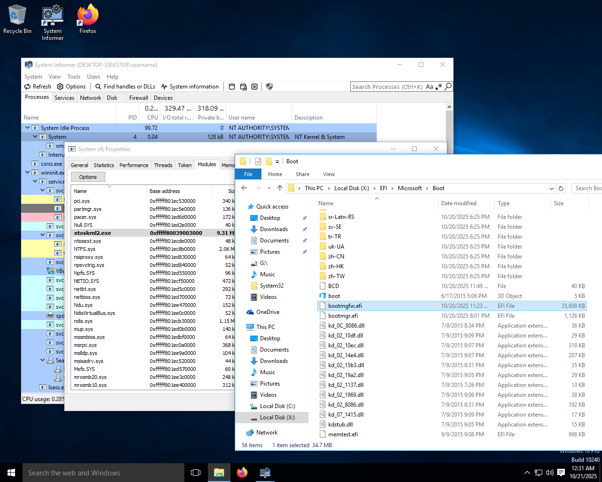

<div align="center">
  
</div>

# Windows CodeDefender

This project demonstrates CodeDefenders ability to obfuscate kernel and bootloader files. The modified system includes obfuscated critical system functions and bypassed security mechanisms.

The repository contains a VirtualBox snapshot of Windows 10 version 1507 running with obfuscated `ntoskrnl.exe` and `bootmgfw.efi` files. If you would like to see additional files obfuscated or additional functions obfuscated, feel free to join our community and ask! [Join our Discord](https://discord.gg/sgedeapTMm) The snapshot can be [downloaded here](https://drive.google.com/file/d/1MEgMP918jg8Ud72N0sNoaf9IZLCfwBf6/view?usp=sharing)

# Why?

Our company goal is to build the worlds best software obfuscator for the Windows platform. We believe that in order to do so we must be as stable as possible. To demonstrate our software protectors capabilities the Windows kernel and boot components are a great proving ground. We are able to meet the demands of some very complicated programs without breaking them. If there are any additional programs or functions you would like to see obfuscated, please reach out and ask us. **We believe that no other software protector on the market can obfuscate these files without breaking them.**

### Additional Notes

- winload.efi is also patched up to allow for loading a custom ntoskrnl.exe.
- All sections in `ntoskrnl.exe` which started with "PAGE" were renamed to an empty section name. This is because the windows loader will make sections which start with "PAGE" pagable. This is an issue because our linker will reuse free space.
- I had to copy the "security directory" from the original ntoskrnl.exe into the obfuscated one and patch up the data directory. Therefore if you click on properties in explorer and see a digital signature but the file is invalid, its because of this. `CodeDefender/BLARE2` does not copy the security directory of a file it processes for obvious reasons.
- A PDB was required to obfuscate ntoskrnl, but no PDB was required to obfuscate all of bootmgfw.efi, this is because I wanted to select some specific functions in ntoskrnl to obfuscate whereas with bootmgfw I wanted to do whole program obfuscation.

### ntoskrnl.exe

The following functions/RVAs have been obfuscated within the Windows kernel:

```
0x482204 - NtOpenFile
0x482310 - IopCreateFile
0x272960 - ExAllocatePoolWithTag
0x155E00 - KiDivideErrorFault
0x482C40 - NtQuerySystemInformation
0x482D60 - ExpQuerySystemInformation
0x155F00 - KiDebugTrapOrFault
0x2057F4 - MmCopyMemory
0x43B940 - MmCopyVirtualMemory
0x5B840  - MiStealPage
```

Additionally, driver signing enforcement and other PatchGuard-related functions have been patched out. The modifications are based on information from the [UPGDSED repository](https://github.com/hfiref0x/UPGDSED/blob/master/src/patterns.h). 

> Not every function in the kernel is obfuscated for performance reasons, if you want to see certain kernel functions obfuscated feel free to ask us!

### bootmgfw.efi

The `ImgpValidateImageHash` function has been patched following the methodology from [EfiGuard](https://github.com/Mattiwatti/EfiGuard). All available functions within bootmgfw have been obfuscated using a light to medium level obfuscation preset.

<div align="center">
  
</div>

### Credits

All of the patching and hacking around in Windows EFI related files is well documented by [EfiGuard](https://github.com/Mattiwatti/EfiGuard), [UPGDSED](https://github.com/hfiref0x/UPGDSED). I'm pretty sure there are other repos with these hooks but these are the two I referenced.  
